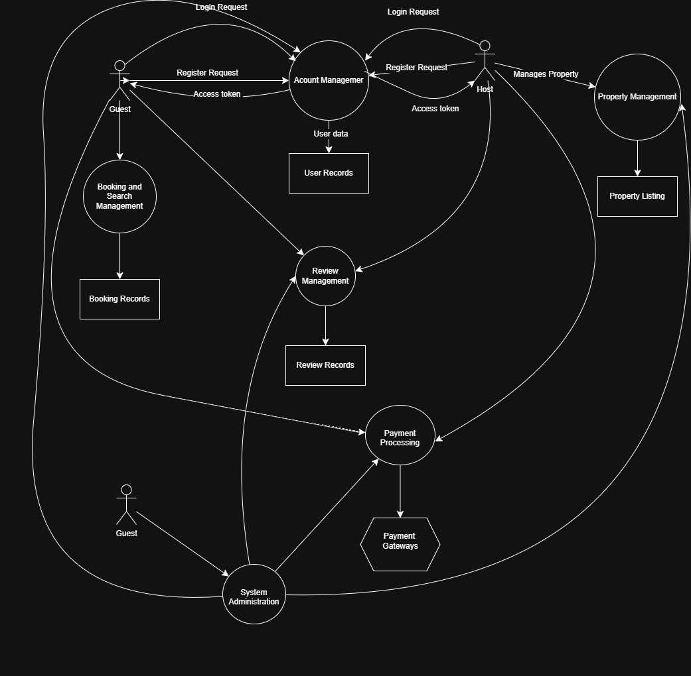

# 🗺️ Data Flow Diagram — Airbnb Clone Backend

## 💡 Overview

This document describes the data flow for the Airbnb Clone backend system. The Data Flow Diagram (DFD) visually represents how data moves between users (guests, hosts, admin) and the system processes.

---

## 📄 Description

A Data Flow Diagram (DFD) helps illustrate:

- **Processes**: Operations or actions performed by the system.
- **External Entities**: Users or external systems interacting with our application.
- **Data Stores**: Places where data is stored for later use.
- **Data Flows**: Movement of data between processes, stores, and external entities.

---

## 🧩 Main Components

### 🧑‍💼 External Entities

- **Guest**: A user who searches, books, and reviews properties.
- **Host**: A user who manages properties and bookings.
- **Admin**: A system administrator who manages overall operations.
- **Payment Gateway**: External service for handling payments.

---

### ⚙️ Processes

- **Account Management**
- **Property Management**
- **Booking and Search**
- **Payment Processing**
- **Review Management**
- **System Administration**

---

### 💾 Data Stores

- **User Database**
- **Property Listings**
- **Booking Records**
- **Payment Records**
- **Review Records**

---

## 🔄 Data Flows

- Guest submits registration or login data to Account Management.
- Host manages property data sent to Property Management.
- Guest searches and sends booking requests to Booking and Search process.
- Payment information flows between Guest/Host and Payment Gateway through Payment Processing.
- Reviews flow from Guests to Review Management and then to Review Records.
- Admin accesses data from all stores via System Administration.

---

## 🗺️ Diagram

