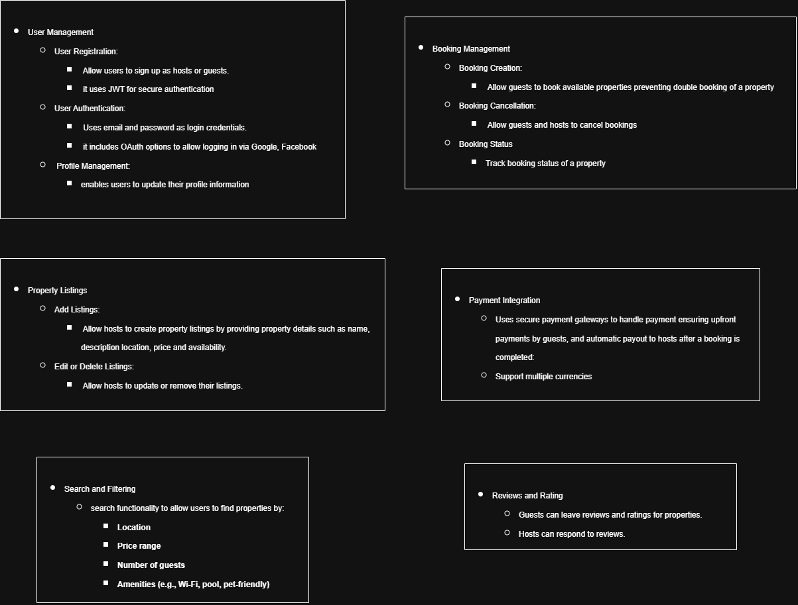

# 🏡 Airbnb Clone Backend — Core Functionalities

## ✨ Overview

This document outlines the core functionalities for the Airbnb Clone backend system. It is designed to provide clarity on the core functionalities of the project.

---

- **Account Management**

- **Searching and Booking**

- **Payment Processing**

- **Reviews**

- **Property Management** and

- **System Management**
  
---

